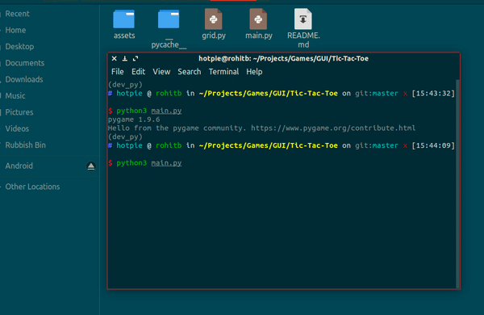
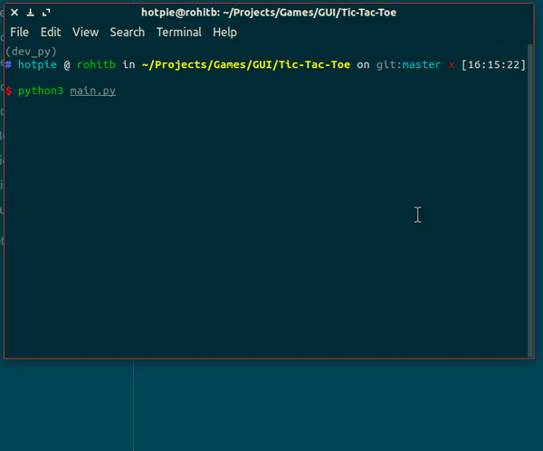

# Tic Tac Toe

This is a GUI based implementation of the classic Tic Tac Toe game using
Alpha-Beta Pruning Algorithm to find the best possible location.  

**NOTE:** Use `requirements.txt` to install the required packages to your virtual environment.  
`$ pip install -r requirements.txt`  

**Demo**:

  

I have to say, You CANNOT win against the game.